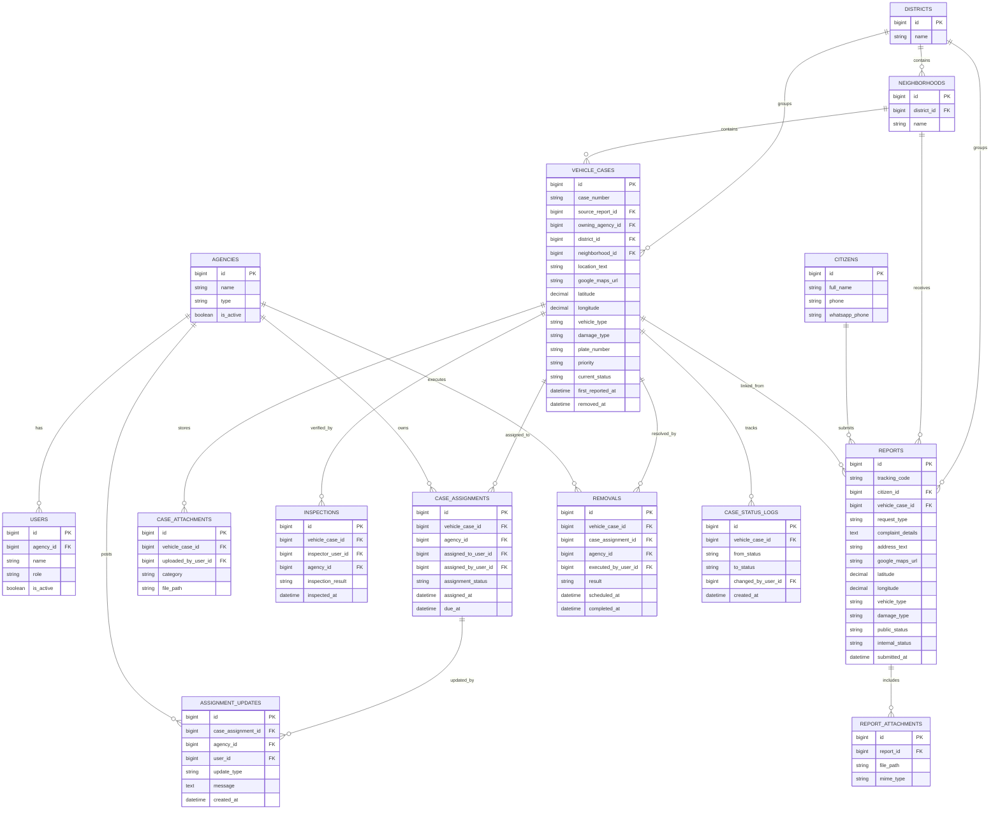

# CleanStreets ERD v2

## الهدف

النظام الآن له مساران واضحان:

- مسار عام للمواطن: يقدّم طلبًا أو شكوى عن سيارة مدمرة من خلال الإنترنت.
- مسار داخلي للجهات: البلدية والمرور وباقي الدوائر تراجع الطلب، تتحقق منه، وتحوله إلى متابعة تنفيذية حتى الإزالة أو الإغلاق.

لهذا السبب أفضل تصميم ليس "جدول طلبات فقط"، بل فصل واضح بين:

- `reports`: الطلبات أو الشكاوى التي يرسلها المواطن من الواجهة العامة.
- `vehicle_cases`: الحالة التشغيلية الحقيقية داخل النظام بعد مراجعة الطلب وربطه أو دمجه مع حالة موجودة.

هذا الفصل مهم جدًا لأن أكثر من مواطن قد يبلّغ عن نفس السيارة.

## القرار المعماري

### القسم العام

المواطن لا يحتاج إلى حساب في المرحلة الأولى.

يقوم فقط بإرسال:

- الاسم
- الهاتف
- وصف السيارة
- وصف الشكوى
- العنوان
- الحي
- صورة أو أكثر
- رابط Google Maps أو إحداثيات الموقع

ثم يحصل على:

- `tracking_code` لمتابعة الطلب

### القسم الداخلي

المرور والبلدية وباقي الدوائر يدخلون من لوحة `Filament` موحدة.

داخل اللوحة يمكنهم:

- مراجعة الطلبات الجديدة
- دمج المكرر
- إنشاء أو تحديث الحالة الفعلية للسيارة
- إسناد الحالة إلى جهة معينة
- إضافة ملاحظات وتحديثات
- تسجيل التحقق الميداني
- تسجيل تنفيذ الإزالة

## الجداول الأساسية

### 1. agencies

الجهات المعنية داخل النظام.

أمثلة:

- مجلس المدينة
- البلدية
- المرور
- مديرية النقل
- الشركة السورية للمعادن

الحقول المقترحة:

- `id`
- `name`
- `type` (`municipality`, `traffic`, `transport`, `recycling`, `district_committee`, `other`)
- `phone` nullable
- `email` nullable
- `address` nullable
- `is_active`
- timestamps

### 2. users

مستخدمو النظام الداخليون فقط.

الحقول المقترحة:

- `id`
- `agency_id` nullable
- `name`
- `email` nullable
- `phone` nullable
- `password`
- `role` (`super_admin`, `reviewer`, `inspector`, `agency_user`, `municipality_admin`, `traffic_admin`)
- `is_active`
- timestamps

ملاحظة:

- كل مستخدم يتبع لجهة واحدة غالبًا عبر `agency_id`.
- الصلاحيات يمكن لاحقًا نقلها إلى package مثل `spatie/laravel-permission`.

### 3. districts

مفيد للتقارير والإحصائيات على مستوى المدينة.

الحقول المقترحة:

- `id`
- `name`
- `code` nullable
- timestamps

### 4. neighborhoods

الأحياء ضمن المدينة.

الحقول المقترحة:

- `id`
- `district_id` nullable
- `name`
- `code` nullable
- timestamps

### 5. citizens

بيانات المواطنين الذين أرسلوا الطلبات.

الحقول المقترحة:

- `id`
- `full_name`
- `phone`
- `whatsapp_phone` nullable
- `email` nullable
- `preferred_contact_method` nullable
- `notes` nullable
- timestamps

ملاحظة:

- هذا الجدول لا يعني أن للمواطن حساب دخول.
- فقط لتخزين بيانات التواصل وإمكانية ربط أكثر من طلب بنفس المواطن.

### 6. reports

هذا هو الطلب أو الشكوى القادمة من الواجهة العامة.

الحقول المقترحة:

- `id`
- `tracking_code` unique
- `citizen_id` nullable
- `vehicle_case_id` nullable
- `submitted_by_user_id` nullable
- `request_type` (`vehicle_removal`, `obstruction`, `follow_up`, `other`)
- `submission_channel` (`web`, `whatsapp_entry`, `phone_entry`, `field_entry`, `internal_entry`)
- `subject` nullable
- `complaint_details`
- `address_text`
- `nearest_landmark` nullable
- `district_id` nullable
- `neighborhood_id` nullable
- `google_maps_url` nullable
- `latitude` nullable
- `longitude` nullable
- `vehicle_type` (`sedan`, `pickup`, `truck`, `bus`, `motorcycle`, `unknown`) nullable
- `damage_type` (`burned`, `destroyed`, `abandoned_wreck`, `partially_damaged`, `unknown`) nullable
- `plate_number` nullable
- `color` nullable
- `make_model` nullable
- `public_status` (`received`, `under_review`, `in_progress`, `resolved`, `closed`, `rejected`)
- `internal_status` (`submitted`, `reviewing`, `linked_to_case`, `duplicate`, `rejected`, `closed`)
- `review_note` nullable
- `submitted_at`
- `reviewed_at` nullable
- `closed_at` nullable
- timestamps

ملاحظات:

- هذا هو أهم جدول في واجهة المواطن.
- `tracking_code` يسمح بمتابعة الطلب لاحقًا.
- `vehicle_case_id` يبقى فارغًا حتى يراجع الموظف الطلب.

### 7. report_attachments

الصور والمرفقات التي يرفعها المواطن مع الطلب.

الحقول المقترحة:

- `id`
- `report_id`
- `file_path`
- `file_name`
- `mime_type`
- `file_size` nullable
- `caption` nullable
- timestamps

### 8. vehicle_cases

الحالة التشغيلية الفعلية داخل النظام بعد مراجعة الطلب.

الحقول المقترحة:

- `id`
- `case_number` unique
- `source_report_id` nullable
- `owning_agency_id` nullable
- `district_id` nullable
- `neighborhood_id` nullable
- `location_text`
- `nearest_landmark` nullable
- `google_maps_url` nullable
- `latitude` nullable
- `longitude` nullable
- `vehicle_type` (`sedan`, `pickup`, `truck`, `bus`, `motorcycle`, `unknown`)
- `damage_type` (`burned`, `destroyed`, `abandoned_wreck`, `partially_damaged`, `unknown`)
- `plate_number` nullable
- `color` nullable
- `make_model` nullable
- `priority` (`low`, `medium`, `high`, `critical`)
- `current_status` (`new`, `under_review`, `verified`, `assigned`, `in_progress`, `scheduled_for_removal`, `removed`, `closed`, `rejected`)
- `reports_count` default 0
- `first_reported_at`
- `last_reported_at`
- `verified_at` nullable
- `removed_at` nullable
- `closed_at` nullable
- `created_by_user_id` nullable
- timestamps

ملاحظات:

- هذا الجدول هو محور العمل الداخلي في Filament.
- عدة `reports` قد تشير إلى نفس `vehicle_case`.

### 9. case_attachments

مرفقات داخلية تخص الحالة نفسها، مثل:

- صور التحقق الميداني
- صور قبل الإزالة وبعدها
- مستندات أو كتب رسمية

الحقول المقترحة:

- `id`
- `vehicle_case_id`
- `uploaded_by_user_id` nullable
- `category` (`inspection`, `removal`, `official_document`, `general`)
- `file_path`
- `file_name`
- `mime_type`
- `file_size` nullable
- `notes` nullable
- timestamps

### 10. inspections

سجل التحقق من الحالة على أرض الواقع.

الحقول المقترحة:

- `id`
- `vehicle_case_id`
- `inspector_user_id`
- `agency_id` nullable
- `inspection_result` (`confirmed`, `not_found`, `duplicate`, `out_of_scope`, `deferred`)
- `notes` nullable
- `inspected_at`
- timestamps

### 11. case_assignments

إسناد الحالة إلى جهة أو قسم لمتابعتها.

الحقول المقترحة:

- `id`
- `vehicle_case_id`
- `agency_id`
- `assigned_to_user_id` nullable
- `assigned_by_user_id` nullable
- `assignment_status` (`sent`, `received`, `in_progress`, `waiting_external_action`, `completed`, `returned`, `cancelled`)
- `assigned_at`
- `responded_at` nullable
- `due_at` nullable
- `completed_at` nullable
- `notes` nullable
- timestamps

### 12. assignment_updates

التحديثات التي تضعها الجهة على الإسناد أو المتابعة.

هذا الجدول مهم لأنه يمثل "بعض العمليات عليه" التي ذكرتها.

الحقول المقترحة:

- `id`
- `case_assignment_id`
- `agency_id` nullable
- `user_id` nullable
- `update_type` (`note`, `accepted`, `field_visit`, `awaiting_approval`, `scheduled`, `completed`, `rejected`, `returned`)
- `message`
- `created_at`

### 13. removals

تسجيل عملية إزالة السيارة أو نقلها فعليًا.

الحقول المقترحة:

- `id`
- `vehicle_case_id`
- `case_assignment_id` nullable
- `agency_id`
- `executed_by_user_id` nullable
- `scheduled_at` nullable
- `started_at` nullable
- `completed_at` nullable
- `destination` nullable
- `result` (`removed`, `partially_removed`, `failed`, `cancelled`)
- `notes` nullable
- timestamps

### 14. case_status_logs

الخط الزمني الرسمي لتغييرات حالة الملف.

الحقول المقترحة:

- `id`
- `vehicle_case_id`
- `from_status` nullable
- `to_status`
- `changed_by_user_id` nullable
- `reason` nullable
- `created_at`

## العلاقات

- `agencies` 1:N `users`
- `districts` 1:N `neighborhoods`
- `districts` 1:N `reports`
- `districts` 1:N `vehicle_cases`
- `neighborhoods` 1:N `reports`
- `neighborhoods` 1:N `vehicle_cases`
- `citizens` 1:N `reports`
- `reports` N:1 `vehicle_cases` nullable
- `reports` 1:N `report_attachments`
- `vehicle_cases` 1:N `case_attachments`
- `vehicle_cases` 1:N `inspections`
- `vehicle_cases` 1:N `case_assignments`
- `case_assignments` 1:N `assignment_updates`
- `vehicle_cases` 1:N `removals`
- `vehicle_cases` 1:N `case_status_logs`
- `agencies` 1:N `case_assignments`
- `agencies` 1:N `assignment_updates`
- `agencies` 1:N `removals`

## Mermaid ERD

## دورة العمل المقترحة

### مسار المواطن

1. يدخل المواطن إلى صفحة عامة.
2. يملأ الطلب ويرفع الصور ويضع العنوان أو رابط Google Maps.
3. ينشأ سجل في `reports`.
4. تحفظ الصور في `report_attachments`.
5. يحصل المواطن على `tracking_code`.

### مسار الجهات

1. الموظف يراجع الطلب الجديد في Filament.
2. إذا كان الطلب صحيحًا ينشئ `vehicle_case` أو يربطه بحالة موجودة.
3. إذا كان الطلب مكررًا يبقى محفوظًا لكن يربط بالحالة نفسها.
4. تسند الحالة إلى البلدية أو المرور أو جهة أخرى عبر `case_assignments`.
5. الجهة تضيف تحديثات في `assignment_updates`.
6. التحقق الميداني يسجل في `inspections`.
7. عند التنفيذ تسجل الإزالة في `removals`.
8. كل انتقال حالة يسجل في `case_status_logs`.

## لماذا هذا التصميم أفضل لهذا المشروع

- يدعم نموذج المواطن بدون حساب.
- يدعم تتبع الطلب من خلال كود مرجعي.
- يمنع تكرار الحالات عندما يرسل عدة مواطنين نفس البلاغ.
- يناسب Filament جدًا لأن العمل الداخلي يتم حول `vehicle_cases`.
- يسمح لكل جهة أن تتابع الجزء الخاص بها من نفس الملف بدون فقدان التاريخ.

## ملاحظات تنفيذية

- في الواجهة العامة سنبني `Public Report Form`.
- في Filament سنبني Resources أساسية لـ:
  - `Reports`
  - `VehicleCases`
  - `CaseAssignments`
  - `Agencies`
  - `Citizens`
- يمكن لاحقًا إضافة صفحة عامة للتحقق من الطلب باستخدام `tracking_code`.

## الخطوة التالية

بعد اعتماد هذا ERD أرى أن الخطوة الصحيحة هي:

1. إنشاء migrations للجداول الأساسية.
2. إنشاء models والعلاقات.
3. تثبيت Filament.
4. بناء فورم المواطن وصفحة تتبع الطلب.
